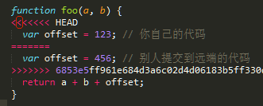

# git日常操作指引
git是一款强大的代码版本控制工具，以下只对日常用到的几项操作做简单说明。包括 ***更新代码、提交代码、冲突解决***

## 更新代码
进入项目根目录，执行以下操作即可获取最新代码
```shell
git pull
```

*****************************

## 提交代码
提交代码分两个阶段，一是提交到本地仓库，二是提交到远端仓库

### 一、提交到本地仓库
其中，提交到本地仓库又分以下几步

#### 1) 添加待提交缓冲
运行以下命令添加所有文件至待提交缓冲池，注意后面是一个英文小数点
```shell
git add .
```
也可运行以下命令添加指定文件至待提交缓冲池
```shell
git add src/routes/xxx.js
```

#### 2) 查看状态
可随时运行以下命令查看状态，以确认缓冲池是否已包含所有待提交文件
```shell
git status
```


如上图，绿色表示已添加至缓冲池的文件，红色表示未添加文件（将不会被提交）

#### 3) 提交到本地仓库
```shell
git commit -m "修改某某某几处BUG"
```
`-m` 参数表示本次提交的备注，必须填写备注才能提交代码。

### 二、提交到远端仓库
以上步骤都完成后，即可提交代码到远端仓库。提交前也可执行`git status`确认一下。然后执行以下命令即可：
```shell
git push
```
当在子分支push时，需带上远端域名及分支名
```shell
git push origin V01R02
```

******************

## 切换分支
当有多个分支并行开发时，可使用以下命令切换分支
```shell
git checkout V01R02
```


## 冲突解决
当两个或以上人员同时修改了同一个文件时，可能会产生文件冲突。这时运行`git pull`会得到如下图的提示：


CONFLICT表示有冲突产生，后面会跟出冲突文件名。此时需打开冲突文件，手动修改后，再执行提交代码流程。

打开冲突文件后，会看到如下图所示的代码：



其中，`<<<<<<< HEAD` 至 `=======` 之间的代码为你本地的代码。

`=======` 至 `>>>>>>> 6653e5ff..` 之间的代码为别人提交到远端仓库的代码。我们需要进行合并处理，得到如下图的代码：


到此，就已经成功解决一个冲突文件。接下来，依次打开其它冲突文件，执行以上操作，直到所有冲突文件都得到解决，才能进行代码提交操作。

## 其它
查看提交记录
```shell
git log
```
查看完成时，按 `q` 键即可退出

更多高级用法，可自行百度

******************
*(END)*
